**Note:** For the screenshots, you can store all of your answer images in the `answer-img` directory.

## Verify the monitoring installation
* Run `kubectl` command to show the running pods and services for all components. Take a screenshot of the output and include it here to verify the installation
* NOTE: I placed the the Jaeger services into the default namespace along with the apps otherwise Jaeger does not see the apps [After various attempts of placing it inside the observability namespace and even enabling cluster wide tracing and using a Jeager_host variable to point to the observability jeager-agent with its port]. (see : simplest(jaeger instance) is in default namespace where the apps are located)

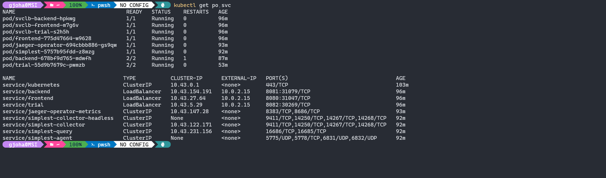
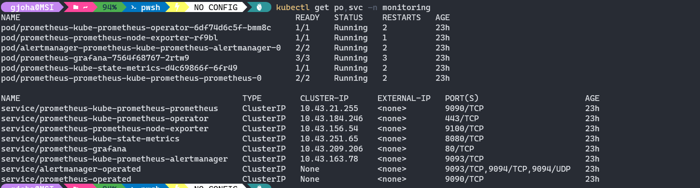

## Setup the Jaeger and Prometheus source
*TODO: Expose Grafana to the internet and then setup Prometheus as a data source. Provide a screenshot of the home page after logging into Grafana.
```
[Get prometheus grafana pod name with command: kubectl get po -n monitoring]
-######## = unique id of pod
 kubectl port-forward -n monitoring prometheus-grafana-######## 3000
```

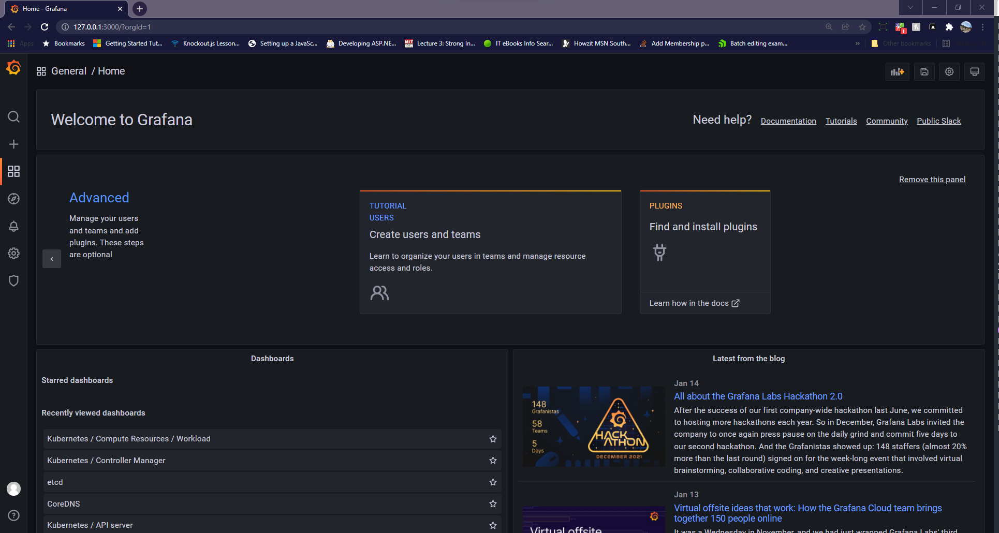


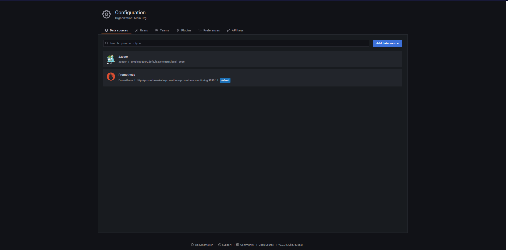
## Create a Basic Dashboard
* Create a dashboard in Grafana that shows Prometheus as a source. Take a screenshot and include it here.  

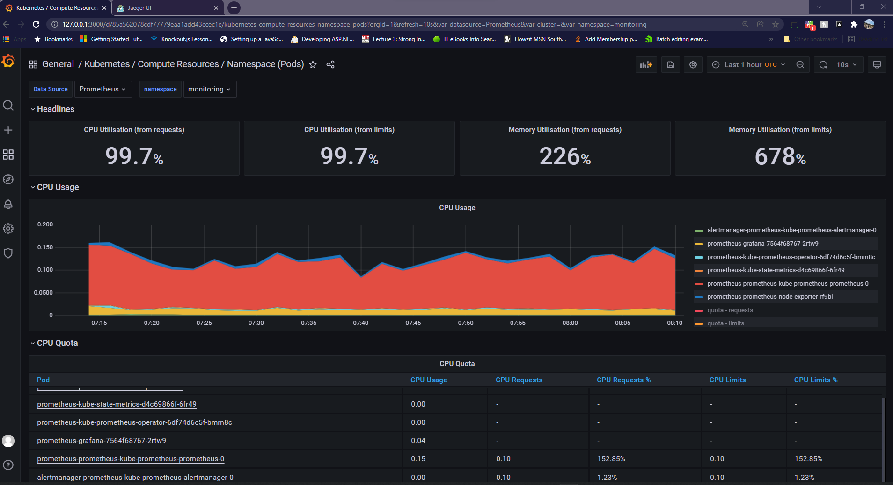
## Describe SLO/SLI
My Service level indicators would be the following for the two service level objectives of "monthly uptime" and "response time"

A Service-Level Objective (SLO) is a measurable goal set by the SRE team.
The SLIs (Service Level indicators) will be our actual measurements of the "monthly uptime" and "request response time" objectives to verify whether we have reached the goals (by means of metrics which are actual measurements)
that we have setup by our SLO (Service Level objectives)


## Creating SLI metrics.
*TODO:* It is important to know why we want to measure certain metrics for our customer. Describe in detail 5 metrics to measure these SLIs. 

We want to base our SLI metrics on the Four Golden Signals
- **Latency** — The time taken to serve a request (usually measured in ms)
- **Traffic** — The amount of stress on a system from demand (such as the number of HTTP requests/second).
- **Errors** — The number of requests that are failing (such as number of HTTP 500 responses).
- **Saturation** — The overall capacity of a service (such as the percentage of memory or CPU used).

Sone of the metrics that can be measured for the SLIs are(They can also overlap one another):
- The average response time of requests [Latency]
- The uptime of the different services (backend, frontend, trial) [Traffic]
- The amount of failed responses per second [Traffic, Errors]
- The average bandwith being used by the network [Traffic, Saturation]
- Amount of CPU and Ram used by the different services (backend, frontend, trial) [Saturation]

## Create a Dashboard to measure our SLIs
*TODO:* Create a dashboard to measure the uptime of the frontend and backend services We will also want to measure to measure 40x and 50x errors. Create a dashboard that show these values over a 24 hour period and take a screenshot.

Backend uptime: \
Source: Prometheus \
PROMQL: sum(up{container=~"backend"}) by (pod)

Frontend uptime: \
Source: Prometheus \
PROMQL: sum(up{container=~"frontend"}) by (pod)

X40 errors: \
Source: Prometheus \
PROMQL: sum(flask_http_request_total{container=~"backend|frontend",status=~"403|404|410"})

50x errors \
Source: Prometheus \
PROMQL: sum(flask_http_request_total{container=~"backend|frontend",status=~"500|503"})

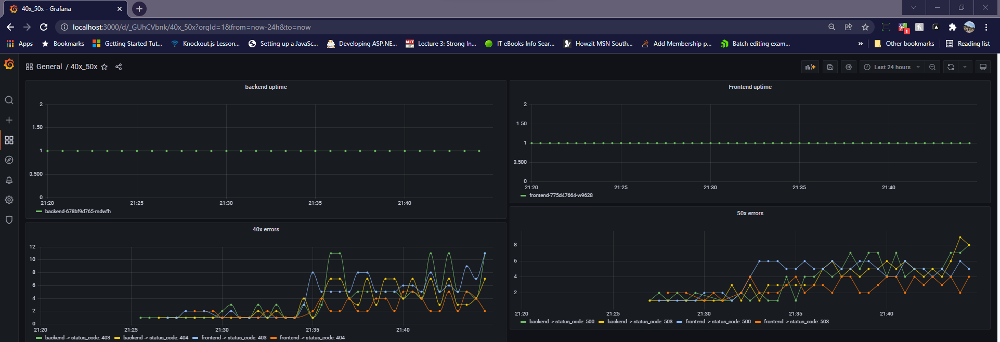

## Tracing our Flask App
*TODO:*  We will create a Jaeger span to measure the processes on the backend. Once you fill in the span, provide a screenshot of it here. Also provide a (screenshot) sample Python file containing a trace and span code used to perform Jaeger traces on the backend service.

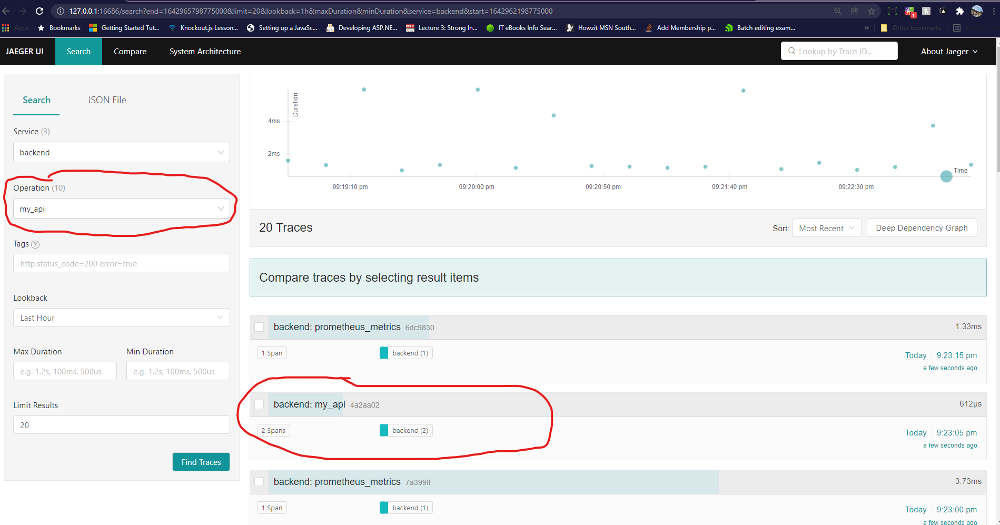
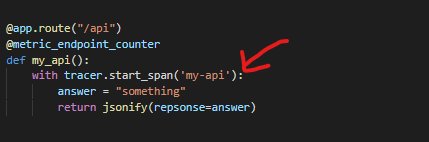

## Jaeger in Dashboards
*TODO:* Now that the trace is running, let's add the metric to our current Grafana dashboard. Once this is completed, provide a screenshot of it here.
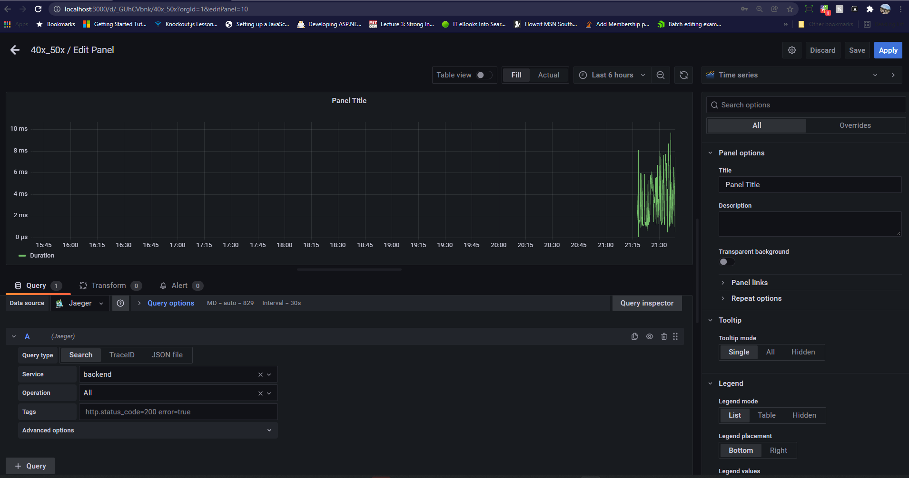

## Report Error
*TODO:* Using the template below, write a trouble ticket for the developers, to explain the errors that you are seeing (400, 500, latency) and to let them know the file that is causing the issue also include a screenshot of the tracer span to demonstrate how we can user a tracer to locate errors easily.

TROUBLE TICKET

Name: 500 error on backend calling star endpoint

Date: January 24 2022, 08:30:51.656

Subject: Error in add-star endpoint, failed to resolve mongo db instance

Affected Area: Backend Service

Severity: High

Description: When the user calls the /star endpoint of the backend service it throws an internal server error. The error points to the fact that the mongo db url does not exist in the cluster 
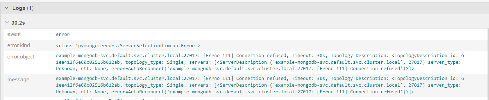
## Creating SLIs and SLOs
*TODO:* We want to create an SLO guaranteeing that our application has a 99.95% uptime per month. Name four SLIs that you would use to measure the success of this SLO.

- Latency
- Uptime
- Failure rate and errors, 
- Resource usage [Saturation]

## Building KPIs for our plan
*TODO*: Now that we have our SLIs and SLOs, create a list of 2-3 KPIs to accurately measure these metrics as well as a description of why those KPIs were chosen. We will make a dashboard for this, but first write them down here.

2-3 KPIs per SLI

### Latency
- request time (in ms) for successful requests
- request time (in ms) for failed requests

### Uptime
- Uptime of the individual services (backend and frontend)
- Pod restarts per namespace
- checking that pods are in ready state and not in an error state

### Failure rate and errors 
We need to understand the type of errors that are happening. Jeager Tracing can help with this.
- 50x errors which are severe because requests are unsuccessful and it can also cause system crashes
- 40x errors which are not as severe but still needs attention

### Resource usage [Saturation]
- CPU usage on each of the services to see if the CPU is not oversaturated (backend and frontend)
- Memory usage on each of the seperate services to see if the services are not running out of memory because of big processos or requests (backend and frontend)

## Final Dashboard
*TODO*: Create a Dashboard containing graphs that capture all the metrics of your KPIs and adequately representing your SLIs and SLOs. Include a screenshot of the dashboard here, and write a text description of what graphs are represented in the dashboard.  

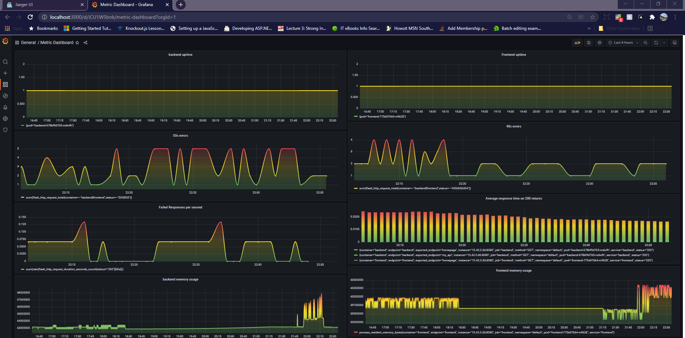
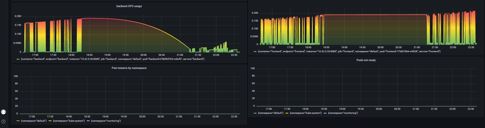


- Uptime Backend Service
- Uptime Frontend Service
- 50x Errors
- 40x Errors
- Failed responses per second
- Average response time on 200(success) returns
- backend memory usage
- frontend memory usage
- backend CPU usage
- frontend CPU usage
- Pod restarts per namespace
- Pods not ready